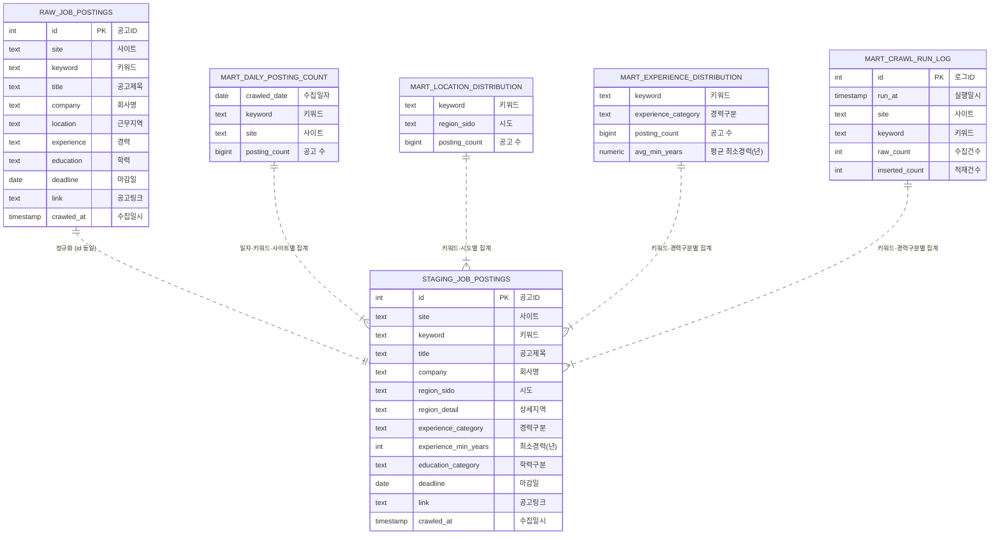

# 채용공고 크롤링 데이터 파이프라인 & 대시보드

채용공고를 크롤링해서 정제·집계하고, Django 대시보드로 서빙하는 엔드투엔드 데이터 파이프라인입니다. 수집부터 운영 배포(Docker, Nginx, HTTPS)까지 전체 과정을 직접 설계하고 운영했습니다.

- **라이브 데모**: https://no-na.duckdns.org *(개인 서버(OCI)에서 운영 중 — 접속이 안 될 경우 재시작 중일 수 있습니다)*
- **작업 과정**: https://no-na.tistory.com/category/project/crawler-project
---

## 아키텍처

```
┌──────────┐     ┌──────────────────────────────────────┐     ┌─────────────┐     ┌───────┐
│ Crawler  │ --> │  PostgreSQL                          │ --> │   Django    │ --> │ Nginx │ --> 사용자
│ (Python) │     │  raw → staging(정규화) → mart(집계)   │     │ (ORM 조회)  │     │ HTTPS │
└──────────┘     └──────────────────────────────────────┘     └─────────────┘     └───────┘
```

- **raw**: 크롤러가 수집한 원본 데이터를 그대로 적재 (원본 보존, 재처리 가능)
- **staging**: 경력/학력/지역을 규칙 기반으로 정규화. 예상 밖 패턴은 `확인필요`로 분류해 크롤러 파싱 오류를 자동 감지
- **mart**: 대시보드용 집계 테이블 3종(일별 건수, 지역 분포, 경력 분포)을 풀 리프레시 방식으로 재생성
- **Django**: mart/staging 테이블을 `managed=False` 모델로 매핑해 읽기 전용으로 서빙
- **Nginx**: HTTPS, 정적 파일 서빙, 리버스 프록시
- 더 자세한 다이어그램은 [`아키텍처`](./docs/architecture.md) 참고.

전체 스택은 Docker Compose로 컨테이너화되어 Oracle Cloud Infrastructure(OCI) 인스턴스에 배포되어 있습니다.

## 운영 스케줄

- 크롤러는 `crontab`으로 평일 오전 9시에 자동 실행되어 raw → staging → mart 전체 파이프라인을 갱신합니다.
```
  0 9 * * 1-5 /home/ubuntu/crawler-project/run_crawler.sh >> /home/ubuntu/crawler-project/cron.log 2>&1
```
- 크롤러 실행 로그는 `logrotate`로 주간 단위 관리됩니다 (`/etc/logrotate.d/crawler`).
```
/home/ubuntu/crawler-project/crawler.log {
weekly
rotate 4
compress
missingok
notifempty
copytruncate
su ubuntu ubuntu
}
```
  최근 4주치 로그만 압축 보관되며, `copytruncate`로 크롤러 실행 중에도 로그 파일을 끊김 없이 교체합니다.

## 기술 스택

| 영역 | 기술 |
|---|---|
| 수집 | Python |
| 저장/처리 | PostgreSQL (raw/staging/mart 3계층) |
| 웹 | Django (unmanaged model 기반 조회 전용 대시보드) |
| 인프라 | Docker, Docker Compose, Oracle Cloud Infrastructure |
| 운영 | Nginx(리버스 프록시), Let's Encrypt(HTTPS), DuckDNS |

## 데이터 모델

> 테이블 간 물리적 FK 제약은 없으며, 점선은 변환·집계에 따른 논리적 관계입니다.



- raw 1 / staging 1 / mart 4, 총 6개 테이블로 구성됩니다.
- 컬럼별 상세 정의와 변환 규칙은 [데이터 항목 정의서](./docs/data-dictionary.md)를 참고하세요.

## 주요 설계 포인트

- **3계층 분리**: 원본 보존(raw)과 정규화 로직(staging), 서빙용 집계(mart)를 분리해 정규화 규칙이 바뀌어도 원본부터 재처리 가능
- **자체 데이터 검증**: `확인필요` 카테고리로 정규화 실패 케이스를 비율로 모니터링(`transform.py`에서 5% 초과 시 경고 로그 출력), 크롤러 쪽 필드 파싱 버그를 간접적으로 탐지
- **읽기 전용 서빙 구조**: Django는 mart/staging 스키마를 `search_path`로 묶어 unmanaged 모델로만 접근, 쓰기는 크롤러/변환 스크립트만 수행하도록 역할 분리
- **운영 배포**: Docker Compose 멀티 서비스(DB, 크롤러, Django, Nginx, Certbot) 구성, HTTPS 자동 갱신(certbot renew 12시간 주기)

## 트러블슈팅 기록

실제 배포 과정에서 겪고 해결한 문제들입니다. 자세한 내용은 [`docs/troubleshooting.md`](./docs/troubleshooting.md) 참고.

- Docker 빌드 시점에는 `env_file`이 주입되지 않아 `collectstatic` 단계에서 `SECRET_KEY` 누락 에러 발생 → entrypoint 스크립트로 런타임 시점에 실행하도록 변경
- mart 집계 테이블에 PK가 없어 Django ORM이 `id` 컬럼을 찾다 에러 → 기존 컬럼을 `primary_key=True`로 지정해 해결 (읽기 전용 용도라 유니크 제약 불필요 판단)
- 재배포 후 Nginx가 이전 컨테이너 IP를 캐싱해 502 Bad Gateway 발생 → 재배포 시 Nginx 재시작을 배포 절차에 포함
- `.env`의 공백 문자 하나로 `ALLOWED_HOSTS` 매칭 실패, 400 에러 지속 → 값 trim 처리 및 오타 디버깅 경험

## 프로젝트 구조

```
crawler-project/
├── docker-compose.yml
├── .env.example
├── nginx/
│   └── nginx.conf              # 리버스 프록시 + HTTPS 설정
├── crawler/
│   ├── Dockerfile
│   ├── main.py                 # 크롤링
│   ├── transform.py            # raw → staging → mart 변환/집계
│   └── db.py                   # DB 연결 공유 모듈
└── webapp/
    ├── Dockerfile
    ├── entrypoint.sh           # collectstatic, migrate, gunicorn 실행
    ├── config/                 # Django 설정
    └── dashboard/
        ├── models.py           # mart/staging 테이블 매핑
        ├── views.py            # 오늘자 대시보드, 필터링
        └── templates/
```

## 실행 방법

```bash
git clone https://github.com/ma1go2/crawler-project.git
cd crawler-project
cp .env.example .env   # 값 채우기
docker compose up -d --build
```


## 로컬 실행 방법

```bash
git clone https://github.com/ma1go2/crawler-project.git
cd crawler-project
cp .env.example .env   # 값 채우기
docker compose up -d --build db web
```
- `docker-compose.yml` web 컨테이너의 expose: - "8000" → ports: - "8000:8000" 으로 변경합니다.
- `http://localhost:8000` (또는 Nginx를 통할 경우 `http://localhost`)에서 확인 가능합니다.
- `nginx`, `certbot`은 실제 도메인을 가진 운영 서버 전용 구성이라 로컬에서는 실행하지 않습니다. 전체 스택(운영 구성 포함)을 실행하려면 `docker compose up -d --build`로 모든 서비스를 띄우되, `nginx.conf`의 인증서 경로 때문에 `nginx_proxy`는 로컬에서 정상 동작하지 않는 점을 참고하세요.

## 대시보드 기능

- 당일 수집된 채용공고 목록 및 사이트/키워드별 집계
- 키워드 · 지역 · 경력 조건 필터링
- mart 테이블 기반 지역/경력 분포 통계

## 향후 개선 방향

- `transform.py` 실행을 Airflow로 스케줄링해 수동 실행 의존성 제거
- 데이터 증가 시 mart 풀 리프레시 → 증분 처리 전환
- 대시보드 시각화(Chart.js 등) 추가
