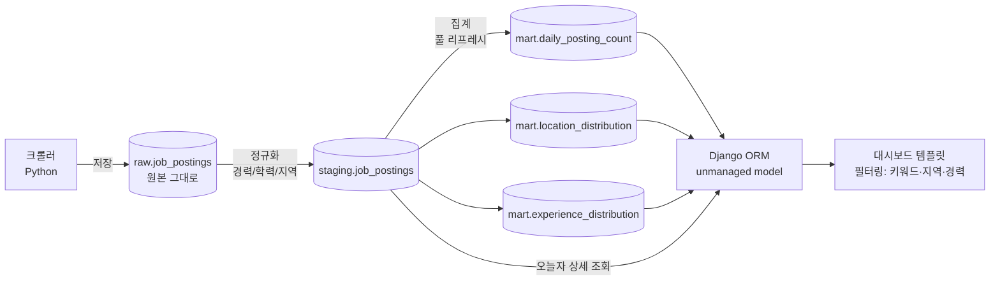
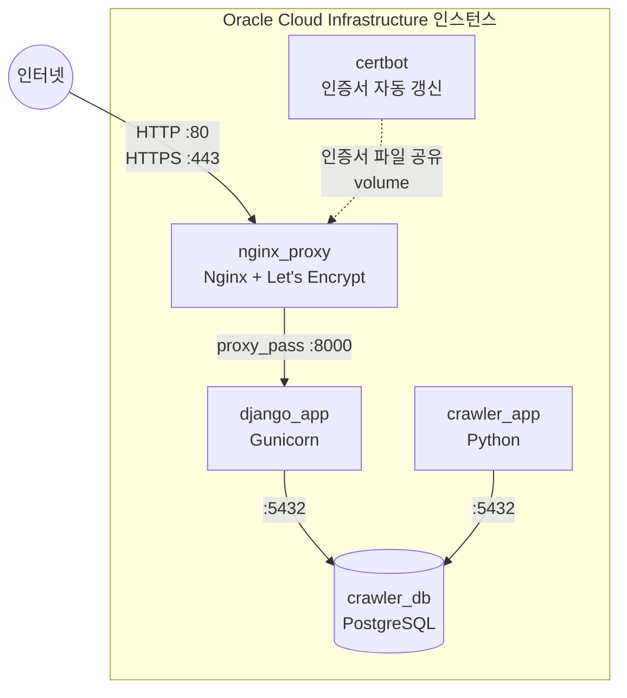

# 아키텍처

## 1. 데이터 파이프라인

크롤링한 원본 데이터가 3단계(raw → staging → mart)를 거쳐 대시보드에 서빙되는 흐름입니다.

**설계 의도**
- `raw`는 원본을 그대로 보존해, 정규화 규칙(`staging`)이 바뀌어도 처음부터 재처리할 수 있게 함
- `staging`에서 예상 밖 패턴은 `확인필요`로 분류 → 이 비율이 5%를 넘으면 경고 로그를 출력해 크롤러 파싱 오류를 자동 감지
- `mart`는 현재 데이터 규모(수천 건)에 맞춰 매번 전체를 다시 만드는 풀 리프레시 방식을 채택 (규모가 커지면 증분 처리로 전환 예정)

## 2. 배포 아키텍처 (Docker Compose)

OCI 인스턴스 위에서 5개 컨테이너가 하나의 Docker 네트워크로 연결되어 동작합니다.

**운영 포인트**
- 외부에 노출되는 포트는 80/443뿐 (5432, 8000은 Docker 내부 네트워크에서만 접근 가능하도록 `expose`로 제한)
- Nginx가 HTTPS 종료 및 정적 파일 서빙을 담당, Django는 애플리케이션 로직에만 집중
- Certbot 컨테이너가 12시간 주기로 인증서 갱신을 자동 체크 (`certbot renew`)
- `crawler_app`은 상시 실행이 아니라 필요 시(또는 스케줄러로) 실행되는 배치성 컨테이너

## 3. 역할 분리 원칙

| 컴포넌트 | 쓰기 권한 | 읽기 권한 |
|---|---|---|
| 크롤러 (`crawler_app`) | raw, staging, mart | - |
| Django (`django_app`) | 없음 (읽기 전용) | staging, mart |

Django는 크롤링 데이터에 쓰기 작업을 하지 않고 조회만 하도록 설계해, 서빙 계층의 장애가 데이터 수집 파이프라인에 영향을 주지 않게 분리했습니다.
