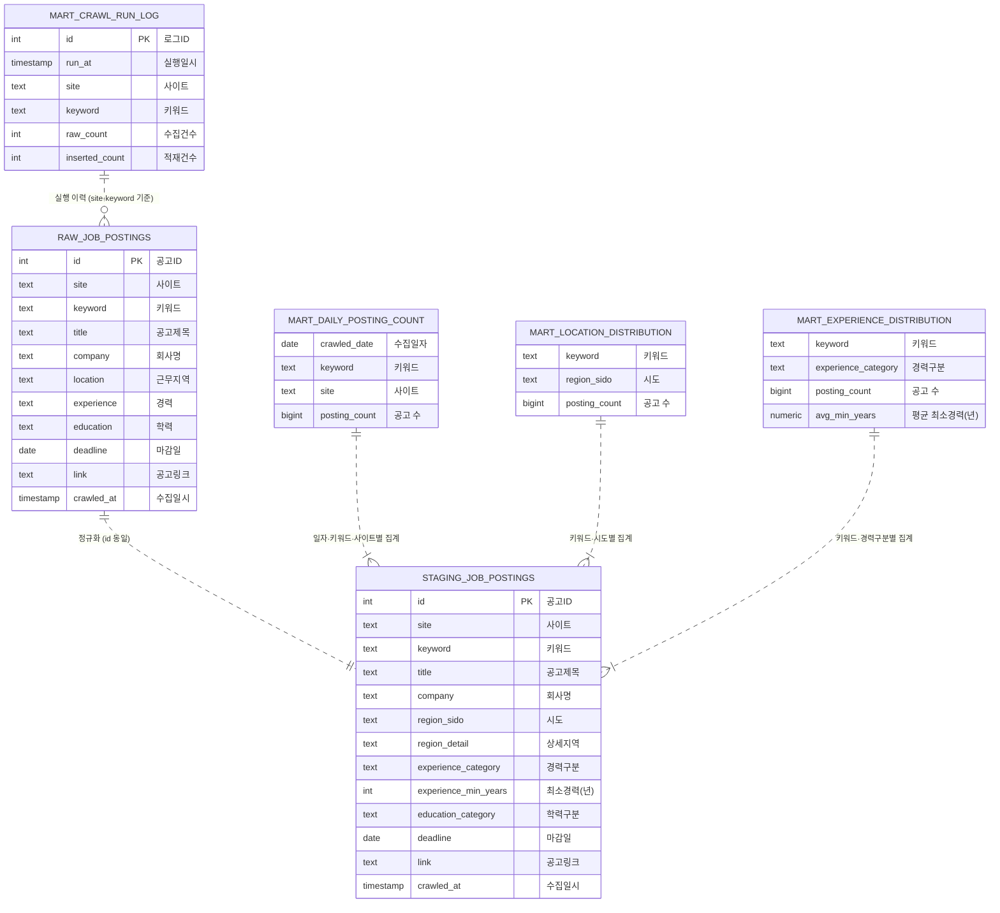

# ERD

> 테이블 간 물리적 FK 제약은 없습니다. 점선은 변환·집계에 따른 **논리적 관계**를 나타냅니다.

## 읽는 방법

| 구분 | 엔티티 | 스키마 |
|---|---|---|
| 원본 | `RAW_JOB_POSTINGS` | raw |
| 정제 | `STAGING_JOB_POSTINGS` | staging |
| 집계 | `MART_DAILY_POSTING_COUNT`, `MART_LOCATION_DISTRIBUTION`, `MART_EXPERIENCE_DISTRIBUTION` | mart |
| 이력 | `MART_CRAWL_RUN_LOG` | mart |

- **raw → staging**: 같은 `id`로 1:1 대응합니다. staging은 매번 raw 전체를 읽어 다시 만듭니다.
- **staging → mart**: mart의 한 행은 staging의 여러 행을 집계한 결과입니다.
- **mart 집계 테이블에 PK가 없는 이유**: `CREATE TABLE ... AS SELECT`로 생성하기 때문입니다.
- 컬럼별 상세 정의는 [데이터 항목 정의서](./data-dictionary.md)를 참고하세요.
